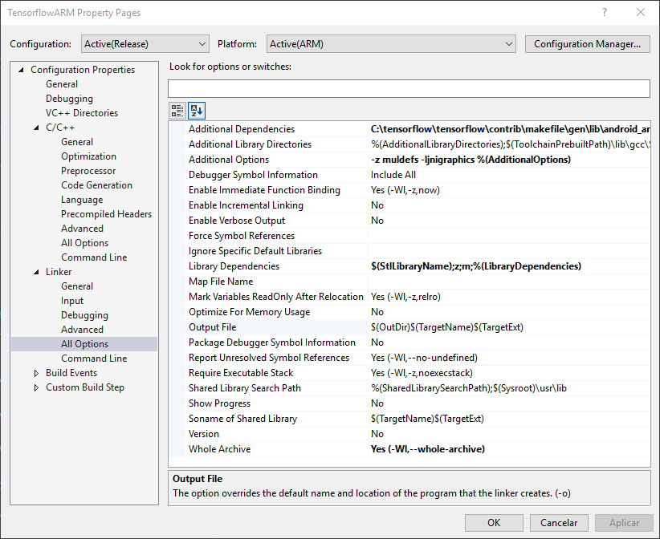

# How to build Tensorflow as a Static Library for Android

This instruction helps who aims to use Tensorflow directly in a C++ application for Android. __So, you won't need to use the Java binding (.jar). Bazel is not required for this instructions__.

## Known-good configurations
In order to build, you'll need the following requirements:

- [Android NDK 14b](https://developer.android.com/ndk/downloads/older_releases) (Android NDK 15c works too.)
- Android SDK 21
- Clang 3.8

> __NOTE__: If you want to build on Windows, you must install _"Linux Bash shell on Windows"_. You can find more details [in this page](https://www.howtogeek.com/249966/how-to-install-and-use-the-linux-bash-shell-on-windows-10/).

## Step-by-step Building

1. Download the [Android NDK 14b](https://developer.android.com/ndk/downloads/older_releases). Extract it wherever you want.
2. Clone/download this [Tensorflow Fork](https://github.com/firdauslubis88/tensorflow).
3. Open Terminal (Linux Bash shell on Windows), go to the Tensorflow Fork root directory and type:
```sh
$ sudo apt-get install autoconf automake libtool curl make g++ unzip zlib1g-dev git python
```
4. Set the NDK_ROOT variable to the path where you extracted Android NDK:
```sh
$ export NDK_ROOT=~/absolute/path/to/NDK/android-ndk-r14b
```
5. Download all dependencies running the commando below:
```sh
$ tensorflow/contrib/makefile/download_dependencies.sh
```
6. Compile __protobuf__ library:
```sh
$ tensorflow/contrib/makefile/compile_android_protobuf.sh -a armeabi-v7a -c
```
7. Compile __nsync__ library for host and target platforms. Change the architecture (```-a``` option) according to your needs.
```sh
$ tensorflow/contrib/makefile/compile_nsync.sh
$ tensorflow/contrib/makefile/compile_nsync.sh -t android -a armeabi-v7a
```
8. Export environment variables with compiled nsync libraries we've just built:
```sh
$ export HOST_NSYNC_LIB='tensorflow/contrib/makefile/downloads/nsync/builds/default.linux.c++11/nsync.a'
$ export TARGET_NSYNC_LIB='tensorflow/contrib/makefile/downloads/nsync/builds/armeabi-v7a.android.c++11/nsync.a'
```
9. Finally, compile static library using make command:
```sh
$ make -f tensorflow/contrib/makefile/Makefile TARGET=ANDROID ANDROID_ARCH=armeabi-v7a
```

## Visual Studio Integration
> __NOTE__: If you built using "Linux bash shell on Windows", you must download/clone the [Tensorflow Fork](https://github.com/firdauslubis88/tensorflow) again into your Windows's file system and copy the contents of the _"tensorflow/contrib/makefile"_ folder to the correspondent folder in Windows.

1. Open Visual Studio 2017, click on File ➡️ New ➡️ Project ➡️ Visual C++ ➡️ Cross Platform ➡️ Android ➡️ Dynamic Library.
2. Change the Solution Configuration to _Release_, and the Solution Platform to _ARM_:


3. Open Project Properties ➡️ General, and change the configurations to the following:


4. In Project Properties ➡️ C/C++ ➡️ All Options, make the following changes:


  __Additional Include Directories__:
  ```
  C:\tensorflow\tensorflow\contrib\makefile\gen\host_obj
  C:\tensorflow\tensorflow\contrib\makefile\gen\protobuf_android\armeabi-v7a\include
  C:\tensorflow\tensorflow\contrib\makefile\downloads\eigen
  C:\tensorflow\tensorflow\contrib\makefile\downloads\nsync\public
  C:\tensorflow
  ```

5. In Project Properties ➡️ Linker ➡️ All Options, make the following changes:


  __Additional Dependencies__:
  ```
  C:\tensorflow\tensorflow\contrib\makefile\gen\lib\android_armeabi-v7a\libtensorflow-core.a
  C:\tensorflow\tensorflow\contrib\makefile\gen\protobuf_android\armeabi-v7a\lib\libprotobuf.a
  C:\tensorflow\tensorflow\contrib\makefile\gen\protobuf_android\armeabi-v7a\lib\libprotobuf-lite.a
  C:\tensorflow\tensorflow\contrib\makefile\gen\protobuf_android\armeabi-v7a\lib\libprotoc.a
  C:\tensorflow\tensorflow\contrib\makefile\downloads\nsync\builds\armeabi-v7a.android.c++11\nsync.a
  ```

You are now ready to write your code to generate a library for an Android application.

### Have you encountered some error?
Please, open an issue! Your problem may help others.

### References

- [Original Documentation](https://github.com/tensorflow/tensorflow/tree/master/tensorflow/contrib/makefile)
- [This issue](https://github.com/tensorflow/tensorflow/issues/11231)
